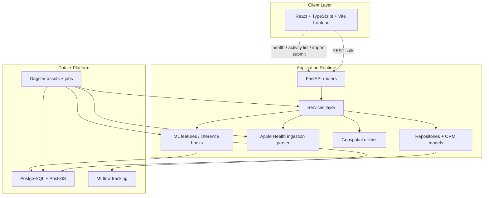
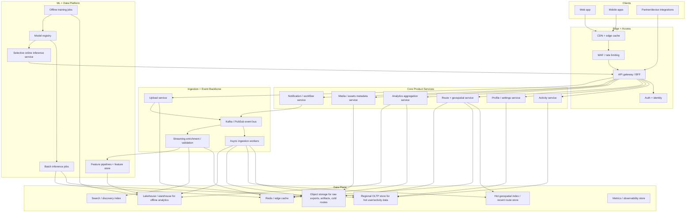

# Altvia Architecture

This document captures two views of Altvia:

1. The current architecture implied by the repository today
2. A future-state architecture designed for Strava-like scale

The future-state version assumes very large ingest volume, global users, bursty workout uploads, and heavy read traffic across activity history, route rendering, and analytics. That scale changes the architecture materially. Some current features would need to move from synchronous or always-on behavior into asynchronous, cached, tiered, or premium-only workflows.

## Current State

This reflects the repo as it exists now: a local-first full-stack system with React, FastAPI, PostgreSQL/PostGIS, Dagster, and MLflow.

### Current-State Notes

- The architecture is clean for a V1 product because the API is thin and business logic lives in services.
- The same services can be used by HTTP endpoints and orchestration jobs, which is the right shape for ingestion and ML-heavy products.
- PostgreSQL with PostGIS is doing a lot of work today: transactional activity data, route geometry, and enrichment persistence.
- Dagster is already the right entry point for data jobs, enrichments, and future model workflows.
- MLflow works as a good early-stage experiment tracking and model-management layer.

### Current Constraints

At large scale, the current design will hit pressure in predictable places:

- FastAPI as a single general-purpose backend becomes too broad if ingestion, analytics, feeds, search, and heavy geospatial computation all live behind it.
- PostgreSQL/PostGIS will become expensive if it remains the hot store for every route, every derived metric, and every analytical query.
- Synchronous import submission patterns will not hold up for bursty mobile sync behavior.
- MLflow alone is usually not enough for enterprise-grade feature serving, online inference controls, or high-volume model operations.
- Rich route analysis on every activity upload will become cost-prohibitive without tiering and caching.

## Future State For Strava-Like Scale

This version assumes the platform needs to tolerate very high ingest rates, background enrichments, a global user base, heavy map usage, and growing analytics or ML demands.

## Why The Future State Is Different

If the target is truly Strava-scale, the biggest change is that Altvia can no longer behave like a single product server backed mostly by one database. It needs to behave like an event-driven platform with storage tiering.

### What Must Change

#### 1. Ingestion Must Become Asynchronous

Uploads from mobile apps, watches, partner APIs, and background sync jobs arrive in unpredictable bursts. The frontend or client should receive an acknowledgement quickly, and the heavy work should move into queues and workers.

That means:

- upload acceptance becomes cheap and fast
- parsing and enrichment move into background workers
- user-visible status becomes job-based rather than request-based

#### 2. Route Data Must Be Tiered

At Strava scale, storing every route and every derived geometry artifact as hot relational data gets expensive quickly.

A more realistic split is:

- hot recent routes and summary geometry in a fast geospatial store
- cold or full-fidelity route artifacts in object storage
- precomputed tiles or summaries cached for popular views

This is one of the first places where fidelity may need to be reduced for cost control.

#### 3. Analytics Must Split Between Transactional And Analytical Systems

The same store should not try to serve:

- user activity CRUD
- map-driven route queries
- long-range historical analysis
- model training features

At scale, transactional workloads belong in an OLTP store, while model features, cohort analytics, and product intelligence belong in a warehouse or lakehouse.

#### 4. ML Needs Selective Real-Time Use

Not every ML feature should run online at Strava scale. The expensive ones should usually become:

- batch precomputations
- cached user-level insights
- selective online inference only for narrow high-value interactions

This is where product scope matters. If every route view triggers expensive geospatial + ML processing, infrastructure costs become unacceptable.

## Features To Limit Or Redesign At Strava Scale

If Altvia grew to Strava-level usage, some current ideas should be constrained.

### Route Analysis

Do not run full route enrichment, elevation analysis, clustering, or model scoring on every upload synchronously.

Better pattern:

- immediate upload acceptance
- cheap summary metrics first
- deeper enrichments asynchronously
- premium or high-value analyses computed on demand or in scheduled jobs

### Historical Recalculation

Avoid reprocessing an entire user history every time feature logic changes.

Better pattern:

- versioned derived datasets
- backfills through controlled jobs
- staged rollout of new metrics

### ML Explanations

Deep per-activity model interpretation for every user and every workout is likely too expensive.

Better pattern:

- batch-generated insight summaries
- cached confidence bands
- richer interpretability for premium or recent activities only

### Full-Fidelity Geospatial Storage

Not every user needs every route at maximum fidelity in the hot path forever.

Better pattern:

- store summaries and simplified geometry hot
- archive full raw traces in object storage
- hydrate detail views only when needed

## Recommended Platform Boundaries

If you want the future-state diagram to feel technically credible, these service boundaries are a good place to stop:

- Activity service
- Upload / ingestion service
- Route and geospatial service
- Analytics aggregation service
- Auth / identity
- Notification / workflow
- Feature pipelines + model platform

That is enough decomposition to support very large scale without over-designing the system into dozens of premature microservices.

## Suggested Captioning For The Case Study

If you want to place these in the portfolio write-up, use framing like this:

### Current Architecture

"The current Altvia architecture is intentionally compact: a React frontend, FastAPI backend, PostgreSQL/PostGIS data layer, Dagster orchestration, and MLflow for experiment tracking. The design keeps the API thin and the business logic reusable across product requests and background jobs."

### Future-State Architecture

"If Altvia were pushed toward Strava-scale usage, the architecture would need to become event-driven and storage-tiered. Uploads would be accepted quickly, heavy enrichments would move into queues and workers, route data would split across hot geospatial stores and cold object storage, and ML would rely more on batch and cached inference than universal real-time scoring."
